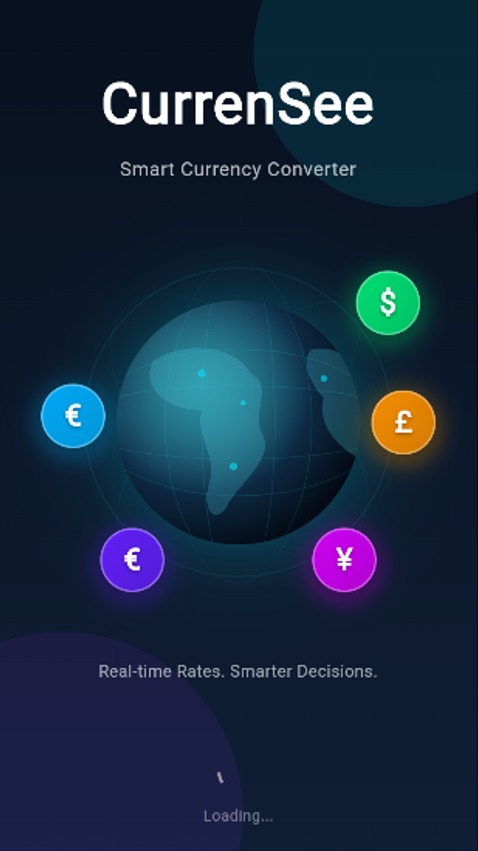
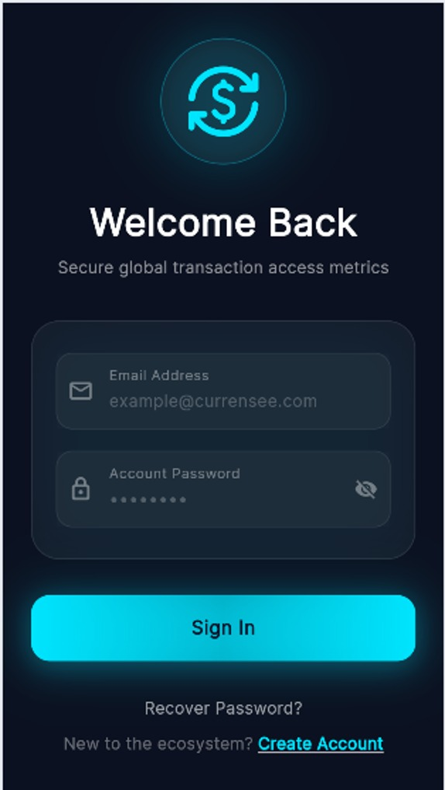
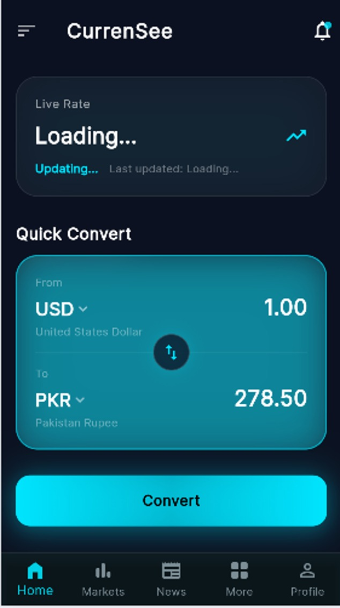
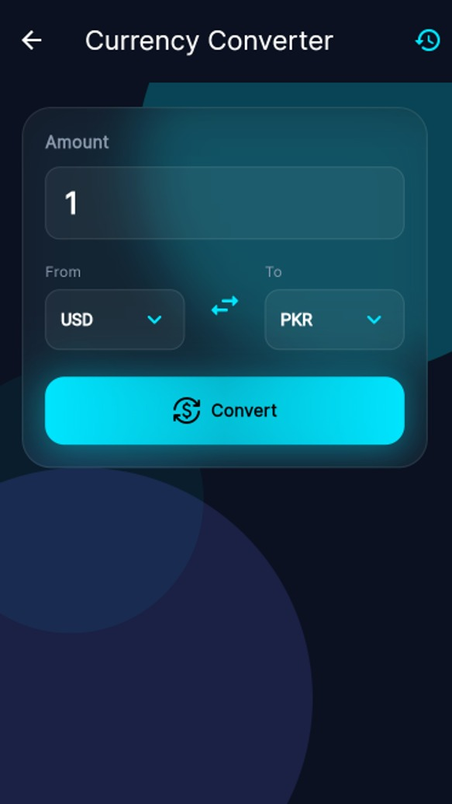
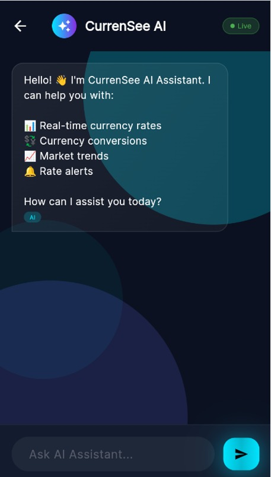
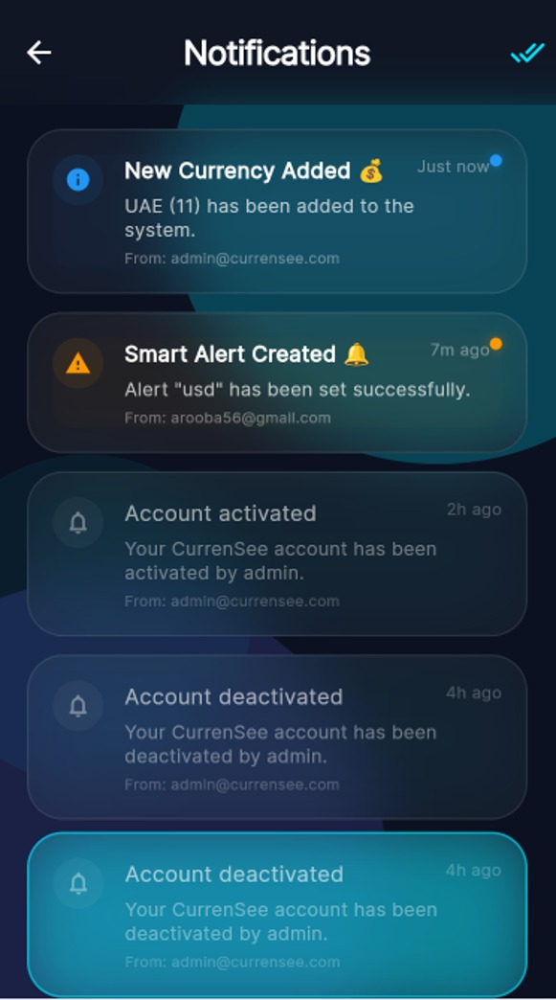
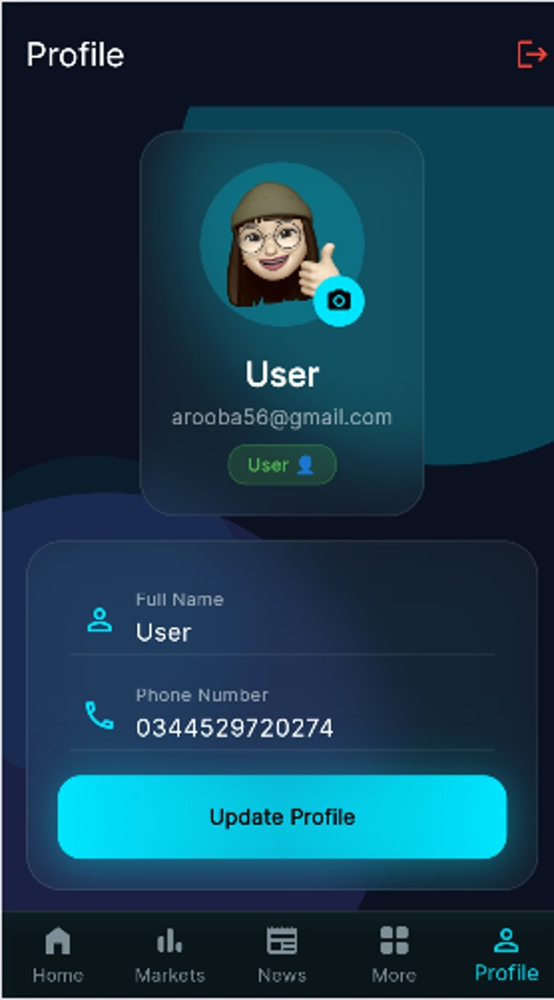
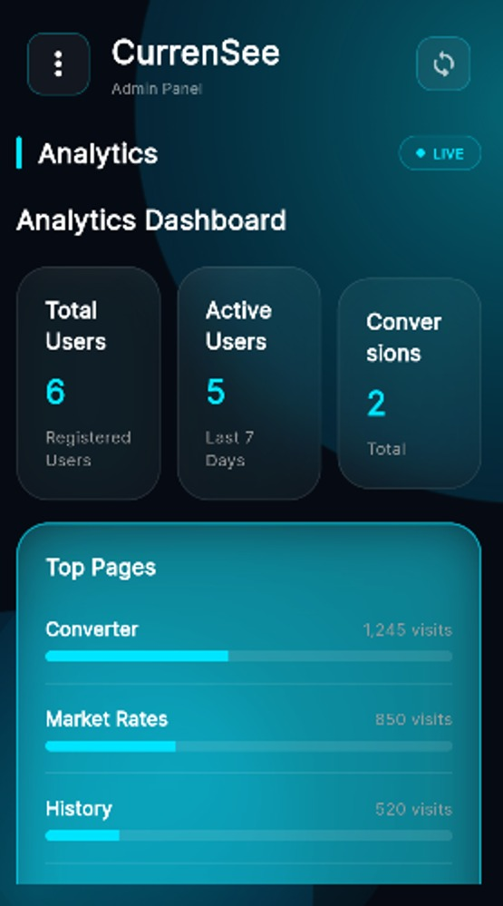

---

# 📑 Table of Contents

- [📖 About](#-about)
- [✨ Features](#-features)
- [📸 App Screenshots](#-app-screenshots)
- [🛠 Tech Stack](#-tech-stack)
- [📂 Project Structure](#-project-structure)
- [🚀 Getting Started](#-getting-started)
- [🔑 Configuration](#-configuration)
- [🌟 Future Enhancements](#-future-enhancements)
- [👩‍💻 Developer](#-developer)
- [⭐ Support](#-support)

---

# 📖 About

CurrenSee is a modern **Flutter-based Currency Converter & Financial Assistant** developed to make currency exchange easier, smarter, and more interactive.

The application combines **live exchange rates**, **AI-powered chatbot assistance**, **market analysis**, **budget planning**, and **financial management tools** into one elegant mobile application.

Designed with a premium **Glassmorphism UI**, smooth animations, and Firebase integration, CurrenSee delivers a fast, secure, and user-friendly experience across multiple platforms.

---

# ✨ Features

## 💱 Currency Conversion

- 🌍 Live Currency Conversion
- 📶 Offline Currency Conversion
- ❤️ Favorite Currency Pairs
- ⚖ Currency Comparison
- 📱 QR Code Sharing

---

## 🤖 AI Financial Assistant

- Gemini AI Integration
- Smart Financial Suggestions
- Currency Information
- AI Chat Support
- Quick Responses

---

## 📈 Market Insights

- 📊 Live Exchange Rates
- 🪙 Gold Prices
- ₿ Cryptocurrency Rates
- 📰 Market News
- 📉 Exchange Rate Charts
- 📈 Trend Analysis

---

## 💼 Finance Management

- Budget Planner
- Spending Tracker
- Travel Cost Estimator
- Conversion History
- PDF Report Export

---

## 🔔 Smart Notifications

- Exchange Rate Alerts
- Smart Notifications
- Personalized Updates
- Important Market Changes

---

## 🔐 Authentication

- Firebase Authentication
- Secure Login
- User Registration
- Forgot Password
- Biometric Login
- User Profile Management

---

## 👨‍💼 Admin Dashboard

- Admin Dashboard
- User Management
- Currency Management
- Exchange Rate Management
- Reports
- Analytics
- Feedback Management

---

# 📸 App Screenshots

<div align="center">

## 🚀 Splash & Authentication

| Splash | Login | Register |
|--------|--------|----------|
|  |  |  |

---

## 🏠 Main Screens

| Home | Dashboard | More |
|------|-----------|------|
|  |  |  |
| Converter | Live Rates | Offline |
|-----------|------------|----------|
|  |  |  |

---

## 🤖 AI Assistant

| AI Chatbot |
|------------|
|  |

---

## 📈 Market & Analytics

| Market News | Crypto | Gold |
|-------------|---------|------|
|  |  |  |

| Exchange Chart | Trends |
|----------------|--------|
|  |  |

---

## 💼 Budget Planner

| Budget Planner | Spending Tracker | Travel Estimator |
|----------------|------------------|------------------|
|  |  |  |

---

## 📂 History

| Conversion History | PDF Export |
|--------------------|------------|
|  |  |

---

## 🔔 Notifications

| Notifications | Smart Alerts |
|---------------|--------------|
|  |  |

---

## 👤 User Profile

| Profile |
|---------|
|  |

---

## 👨‍💼 Admin Panel

| Dashboard | Users | Reports |
|------------|-------|----------|
|  |  |  |

| Analytics | Feedback | Settings |
|------------|----------|----------|
|  |  |  |

</div>

---

# 🛠 Tech Stack

<div align="center">

| Technology | Purpose |
|------------|---------|
| 🩵 Flutter | Cross-platform App Development |
| 🎯 Dart | Programming Language |
| 🔥 Firebase Authentication | User Authentication |
| ☁ Cloud Firestore | Cloud Database |
| 🖼 Cloudinary | Image Storage |
| 🤖 Gemini AI | AI Chatbot |
| 💱 ExchangeRate API | Live Currency Rates |
| 📄 PDF Package | Export Reports |
| 📱 QR Flutter | QR Code Sharing |
| 🎨 Glassmorphism UI | Modern User Interface |

</div>

---

# 🌟 Highlights

- ✅ Beautiful Glassmorphism UI
- ✅ Real-Time Currency Conversion
- ✅ Gemini AI Powered Chatbot
- ✅ Live Exchange Rates
- ✅ Gold & Cryptocurrency Prices
- ✅ Firebase Authentication
- ✅ Offline Currency Conversion
- ✅ Budget Planner
- ✅ Spending Tracker
- ✅ PDF Export
- ✅ Smart Notifications
- ✅ Admin Dashboard
- ✅ Cross Platform Support
- ✅ Smooth Animations
- ✅ Responsive Design

---# 📂 Project Structure

```text
CurrenSee
│
├── android/
├── ios/
├── linux/
├── macos/
├── windows/
├── web/
│
├── assets/
│   ├── data/
│   └── screenshots/    # All app screenshots
│
├── lib/
│   ├── core/
│   │   ├── models/
│   │   ├── providers/
│   │   ├── services/
│   │   ├── theme/
│   │   └── utils/
│   │
│   ├── screens/
│   │   ├── admin/
│   │   ├── alerts/
│   │   ├── auth/
│   │   ├── calculator/
│   │   ├── chatbot/
│   │   ├── converter/
│   │   ├── currency/
│   │   ├── history/
│   │   ├── home/
│   │   ├── market/
│   │   ├── onboarding/
│   │   ├── planner/
│   │   ├── settings/
│   │   └── splash/
│   │
│   ├── widgets/
│   │
│   ├── firebase_options.dart
│   └── main.dart
│
├── pubspec.yaml
└── README.md
```

---

# 🚀 Getting Started

## 1️⃣ Clone Repository

```bash
git clone https://github.com/Arooba-Kamal/CurrenSee.git
```

---

## 2️⃣ Navigate to Project

```bash
cd CurrenSee
```

---

## 3️⃣ Install Packages

```bash
flutter pub get
```

---

## 4️⃣ Run the App

```bash
flutter run
```

---

# 🔑 Configuration

Before running the project, configure the following services:

- 🔥 Firebase Authentication
- ☁ Cloud Firestore
- 🖼 Cloudinary
- 🤖 Gemini AI API
- 💱 ExchangeRate API


---

# 🎯 Future Enhancements

- 🎤 Voice Assistant
- 🌍 Multi-language Support
- 📈 AI Currency Forecasting
- 📊 Advanced Expense Analytics
- 🌙 Dark / Light Theme Switching
- ⌚ Wear OS Support
- 🍎 Apple Watch Support
- 📱 Home Screen Widgets
- 🔔 Push Notifications
- 📡 Real-time Sync

---

# 🤝 Contributing

Contributions are always welcome!

1. Fork this repository
2. Create a new feature branch

```bash
git checkout -b feature-name
```

3. Commit your changes

```bash
git commit -m "Add new feature"
```

4. Push your branch

```bash
git push origin feature-name
```

5. Open a Pull Request 🚀

---

# 👩‍💻 Developer

<div align="center">

## **Arooba Kamal**

Flutter Developer 💙

Passionate about building modern mobile applications using Flutter, Firebase, REST APIs and AI technologies.

### 🌐 Connect with Me

[](https://github.com/Arooba-Kamal)

</div>

---

# 💙 Acknowledgements

Special thanks to:

- Flutter Team
- Firebase
- Google Gemini AI
- ExchangeRate API
- Open Source Community ❤️

---

<div align="center">

# ⭐ If you like this project...

### Please consider giving it a ⭐ on GitHub!

It motivates me to build more amazing Flutter projects.

<br>

Made with ❤️ using Flutter

</div>

---

